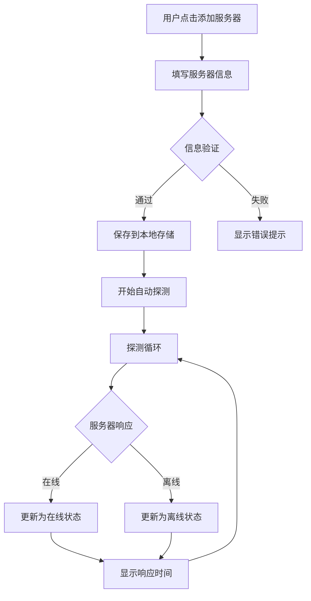

# 服务器探针面板 - 产品需求文档

## 1. 产品概述

一款支持多服务器监控的探针面板，用户可添加任意数量的服务器，实时监测其在线状态、响应时间等关键指标。适用于运维人员、开发者或个人站长集中管理多台服务器状态。

- 核心功能：添加/删除服务器、实时探测、状态展示、历史记录
- 目标用户：运维工程师、开发者、站长

## 2. 核心功能

### 2.1 功能模块

1. **服务器列表页**
   - 展示所有已添加服务器的状态卡片
   - 支持添加新服务器
   - 支持删除/编辑服务器
   - 支持批量操作

2. **添加服务器弹窗**
   - 服务器名称（自定义别名）
   - 服务器地址（IP或域名）
   - 端口号（默认80）
   - 探测协议（HTTP/HTTPS/TCP/PING）
   - 探测间隔设置

3. **服务器状态卡片**
   - 服务器名称与地址
   - 在线/离线状态指示
   - 最后响应时间
   - 在线时长统计
   - 立即探测按钮
   - 编辑/删除操作

4. **实时探测引擎**
   - 自动定时探测
   - 支持 HTTP/HTTPS/TCP/PING 四种协议
   - 计算响应时间、可用率
   - 状态变更记录

### 2.2 页面详情

| 页面 | 模块 | 功能描述 |
|------|------|----------|
| 主面板 | 顶部导航栏 | Logo、标题、添加服务器按钮 |
| 主面板 | 服务器卡片网格 | 自适应布局展示所有服务器状态 |
| 主面板 | 添加服务器弹窗 | 表单收集服务器信息 |
| 主面板 | 空状态提示 | 无服务器时引导用户添加 |

## 3. 核心流程

### 3.1 添加服务器流程

```
用户点击"添加服务器" → 弹出添加弹窗 → 填写服务器信息 → 点击确认 → 服务器添加到列表 → 开始自动探测
```

### 3.2 探测流程

```
定时器触发 → 遍历所有服务器 → 发送探测请求 → 记录响应时间 → 更新状态 → 渲染UI
```

### 3.3 流程图



## 4. 用户界面设计

### 4.1 设计风格

**风格定位：科技感监控仪表盘**

- 主色调：深色背景 (#0f172a) 搭配霓虹色状态指示
- 状态颜色：
  - 在线：#10b981 (翠绿色) 带发光效果
  - 离线：#ef4444 (红色) 带脉冲动画
  - 警告：#f59e0b (琥珀色)
- 字体：JetBrains Mono (数据显示) + Noto Sans SC (界面文字)
- 布局：响应式网格，卡片式设计
- 动效：状态切换呼吸灯、卡片悬浮提升、进度条动画

### 4.2 页面设计概述

| 模块 | UI元素 | 样式描述 |
|------|--------|----------|
| 顶部导航 | Logo + 标题 + 添加按钮 | 毛玻璃效果背景，霓虹蓝渐变按钮 |
| 服务器卡片 | 状态灯 + 名称 + 地址 + 指标 | 玻璃态卡片，悬浮发光边框，动态状态灯 |
| 添加弹窗 | 输入框 + 协议选择 + 确认按钮 | 居中弹窗，毛玻璃遮罩，表单验证高亮 |
| 空状态 | 插画 + 引导文案 + 添加按钮 | 居中布局，简约图标，渐变文字 |

### 4.3 响应式策略

- 桌面端 (>1024px)：3-4列网格布局
- 平板端 (768-1024px)：2列网格
- 移动端 (<768px)：单列堆叠，卡片全宽

### 4.4 动画设计

- 状态灯：在线时呼吸动画，离线时脉冲闪烁
- 卡片入场：staggered fade + scale，从下方滑入
- 按钮交互：hover 时 scale 1.02 + 发光增强
- 探测进度：环形进度动画
