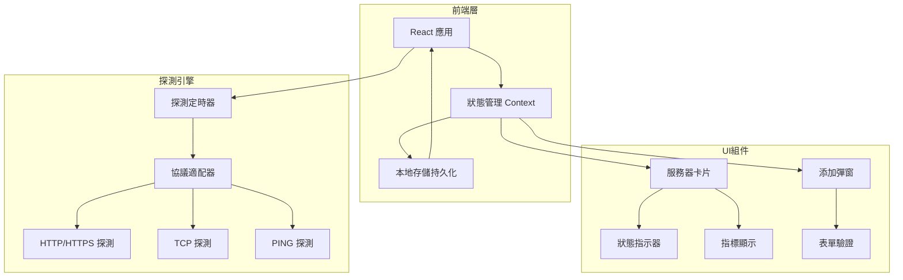

# 服务器探针面板 - 技術架構文檔

## 1. 架構設計



## 2. 技術選型

- **前端框架**：React@18 + Vite
- **樣式方案**：Tailwind CSS@3 + 自定義CSS變量
- **狀態管理**：React Context + useReducer
- **數據持久化**：localStorage
- **圖標**：Lucide React
- **字體**：Google Fonts (JetBrains Mono + Noto Sans SC)

## 3. 組件架構

```
src/
├── components/
│   ├── ServerCard.jsx        # 服務器狀態卡片
│   ├── AddServerModal.jsx     # 添加服務器彈窗
│   ├── StatusIndicator.jsx   # 狀態指示燈
│   ├── EmptyState.jsx         # 空狀態引導
│   └── Header.jsx             # 頂部導航
├── context/
│   └── ServerContext.jsx      # 服務器狀態管理
├── hooks/
│   └── useProbe.js            # 探測邏輯鉤子
├── utils/
│   ├── probe.js               # 探測方法實現
│   └── storage.js             # localStorage 封裝
├── App.jsx
├── main.jsx
└── index.css                  # 全局樣式 + CSS變量
```

## 4. 數據模型

### 4.1 服務器數據結構

```typescript
interface Server {
  id: string;              // 唯一標識 (UUID)
  name: string;            // 自定義名稱
  address: string;         // IP 或域名
  port: number;            // 端口號
  protocol: 'http' | 'https' | 'tcp' | 'ping';  // 探測協議
  interval: number;        // 探測間隔 (秒)
  createdAt: number;        // 添加時間戳
  status: 'online' | 'offline' | 'checking';
  lastResponseTime: number | null;  // 最後響應時間 (ms)
  lastCheckTime: number | null;      // 最後探測時間
  uptime: number;          // 在線時長 (秒)
}
```

### 4.2 持久化結構

```typescript
interface StorageData {
  servers: Server[];
  settings: {
    defaultInterval: number;
  };
}
```

## 5. 探測實現

### 5.1 HTTP/HTTPS 探測

```javascript
// 使用 fetch 測量響應時間
async function probeHttp(url, timeout = 5000) {
  const start = performance.now();
  try {
    const response = await fetch(url, {
      method: 'HEAD',
      mode: 'no-cors',
      signal: AbortSignal.timeout(timeout)
    });
    return performance.now() - start;
  } catch {
    return null;
  }
}
```

### 5.2 TCP 探測

```javascript
// 使用 WebSocket 測試 TCP 端口
async function probeTcp(address, port, timeout = 5000) {
  return new Promise((resolve) => {
    const start = performance.now();
    const ws = new WebSocket(`ws://${address}:${port}`);
    const timer = setTimeout(() => {
      ws.close();
      resolve(null);
    }, timeout);
    ws.onopen = () => {
      clearTimeout(timer);
      ws.close();
      resolve(performance.now() - start);
    };
    ws.onerror = () => {
      clearTimeout(timer);
      resolve(null);
    };
  });
}
```

### 5.3 PING 探測

```javascript
// 使用 RTCPeerConnection 測試連通性
async function probePing(address, timeout = 5000) {
  const start = performance.now();
  try {
    const pc = new RTCPeerConnection({ iceServers: [] });
    pc.createDataChannel('');
    await pc.createOffer().then(offer => pc.setLocalDescription(offer));
    setTimeout(() => {
      pc.close();
    }, timeout);
    return performance.now() - start;
  } catch {
    return null;
  }
}
```

## 6. 狀態管理

```javascript
// ServerContext reducer actions
const actions = {
  ADD_SERVER: 'ADD_SERVER',
  REMOVE_SERVER: 'REMOVE_SERVER',
  UPDATE_SERVER: 'UPDATE_SERVER',
  UPDATE_STATUS: 'UPDATE_STATUS',
  LOAD_FROM_STORAGE: 'LOAD_FROM_STORAGE'
};
```

## 7. 性能優化

- 使用 `useMemo` 緩存服務器列表
- 使用 `useCallback` 緩存探測函數
- 狀態更新時採用批量更新策略
- 卡片採用虛擬化列表 (服務器數量 > 50 時)
